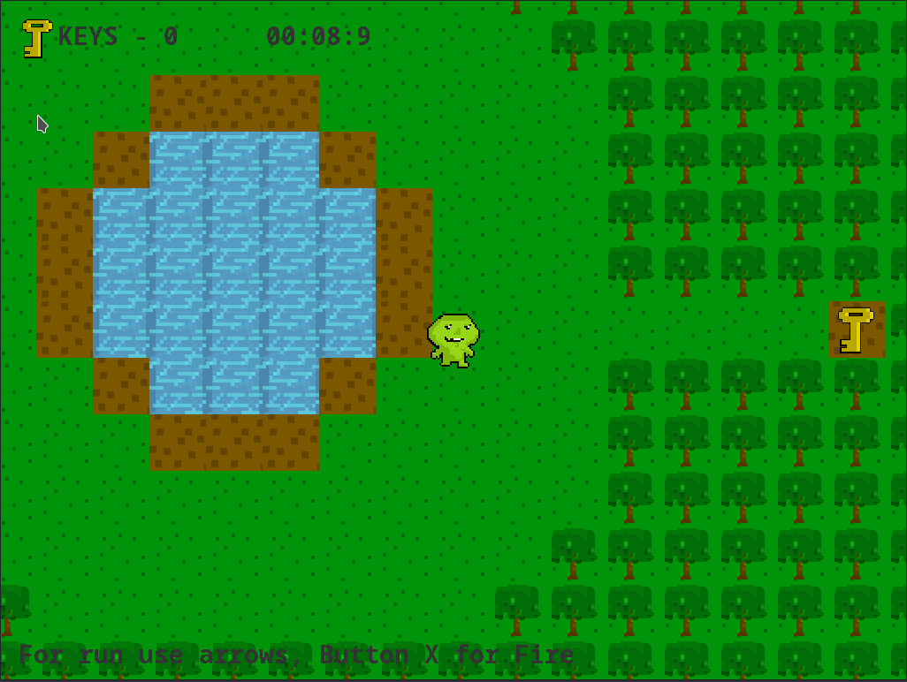
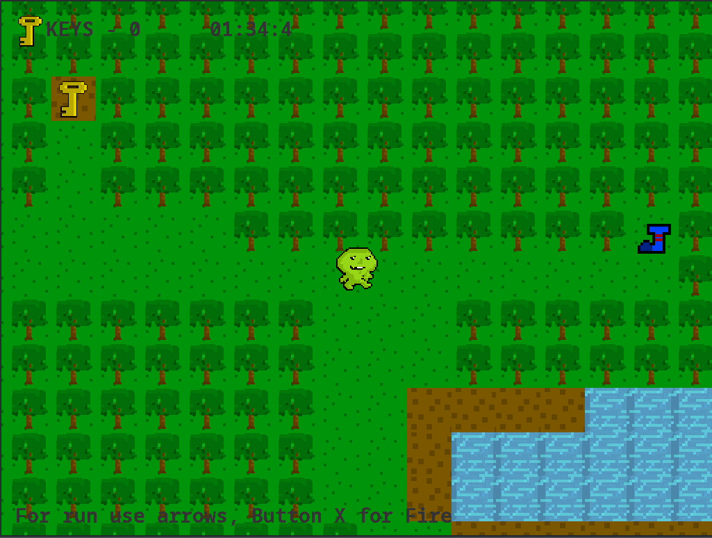

# What is it?

Short adventure of green dude who try to finde exit of this game.
In this game you can collect keys open doors and throw fire balls but there isn&rsquo;t any enemy. I think because green dude is a cool guy and he doesn&rsquo;t have any enemy.
Game process usually spents about 30 seconds. Good luck and have fun:D

# Launch

    ./gradlew run

# Screenshots

# P.S.

To be honest it&rsquo;s a small application where I wanted to try kotlin
